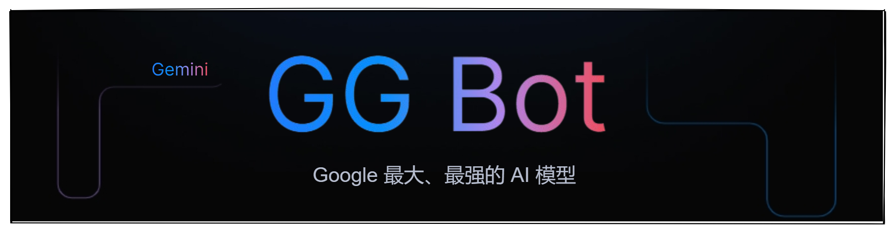

# GG Bot

使用 Google 提供的 [Gemini API](https://ai.google.dev/gemini-api/docs?hl=zh-cn) 构建的一款文本生成式聊天应用，采用`gemini-1.5-flash`模型。在这里你将体验到 Google 最大、最强的 AI 模型 Gemini，支持多语言；可对图片、音频、视频等内容进行分析，将您的想法转化为切实可行且可大规模应用的应用。以下列举部分模型。

| 模型变体          | 输入                 | 输出 |	优化目标 |
| ---------------- | -------------------- | ---- | --- |
| gemini-1.5-pro   | 音频、图片、视频和文字 | 文字 | 复杂的推理任务，如代码和文本生成， 文本编辑、问题解决、数据提取和生成 |
| gemini-1.5-flash | 音频、图片、视频和文字 | 文字 | 以多种方式快速处理各种任务 |
| gemini-1.0-pro   | 文字                 | 文字 | 自然语言任务、多轮文本和代码聊天以及代码 世代 |

> 为什么叫 GG Bot 呢？刚好那会想到了 GG Bond(猪猪侠)，模型名称又以 G 开头，嘿嘿 完美。

## Feature

This is a [Next.js](https://nextjs.org/) project bootstrapped with [`create-next-app`](https://github.com/vercel/next.js/tree/canary/packages/create-next-app).

## Getting Started

First, run the development server:

```bash
npm run dev
# or
yarn dev
# or
pnpm dev
# or
bun dev
```

Open [http://localhost:3000](http://localhost:3000) with your browser to see the result.

You can start editing the page by modifying `app/page.tsx`. The page auto-updates as you edit the file.

This project uses [`next/font`](https://nextjs.org/docs/basic-features/font-optimization) to automatically optimize and load Inter, a custom Google Font.

## Learn More

To learn more about Next.js, take a look at the following resources:

- [Next.js Documentation](https://nextjs.org/docs) - learn about Next.js features and API.
- [Learn Next.js](https://nextjs.org/learn) - an interactive Next.js tutorial.

You can check out [the Next.js GitHub repository](https://github.com/vercel/next.js/) - your feedback and contributions are welcome!

## Deploy on Vercel

The easiest way to deploy your Next.js app is to use the [Vercel Platform](https://vercel.com/new?utm_medium=default-template&filter=next.js&utm_source=create-next-app&utm_campaign=create-next-app-readme) from the creators of Next.js.

Check out our [Next.js deployment documentation](https://nextjs.org/docs/deployment) for more details.
