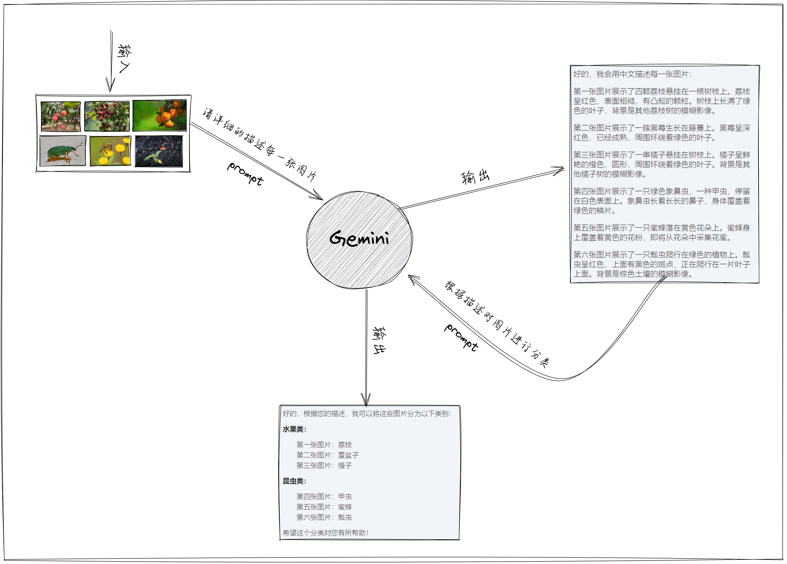

# GG Bot

This is a [Next.js](https://nextjs.org/) project bootstrapped with [`create-next-app`](https://github.com/vercel/next.js/tree/canary/packages/create-next-app).

使用 Google 提供的 [Gemini API](https://ai.google.dev/gemini-api/docs?hl=zh-cn) 构建的一款文本生成式聊天应用，采用`gemini-1.5-flash`模型。在这里你将体验到 Google 最大、最强的 AI 模型 Gemini，支持多语言；可对图片、音频、视频等内容进行分析，将您的想法转化为切实可行且可大规模应用的应用。以下列举部分模型。

| 模型变体         | 输入                   | 输出 | 优化目标                                                              |
| ---------------- | ---------------------- | ---- | --------------------------------------------------------------------- |
| gemini-1.5-pro   | 音频、图片、视频和文字 | 文字 | 复杂的推理任务，如代码和文本生成， 文本编辑、问题解决、数据提取和生成 |
| gemini-1.5-flash | 音频、图片、视频和文字 | 文字 | 以多种方式快速处理各种任务                                            |
| gemini-1.0-pro   | 文字                   | 文字 | 自然语言任务、多轮文本和代码聊天以及代码 世代                         |

> 为什么叫 GG Bot 呢？刚好那会想到了 GG Bond(猪猪侠)，模型名称又以 G 开头，嘿嘿 完美。

你可以克隆该项目，将环境文件中的`NEXT_PUBLIC_API_KEY`替换成自己的 key，这样你就有了自己的 bot 了。

## Feature

- 图片分析。
  

- 音频分析
  

- 视频分析

> 很多时候，输出的内容跟提示词(prompt)有着很大的关系。

## Interesting

- 可以帮助你解决学习中的一些难以理解或知识盲点的问题。
  
- 可以助你理解分析祖传代码逻辑，甚至可以帮你写代码以及提取、生成数据等，让你成为真正的 CV 工程师。
  
- 生活得有乐趣：给阿姨倒杯卡布奇诺。
  

## Getting Started

First, run the development server:

```bash
npm run dev
# or
yarn dev
# or
pnpm dev
# or
bun dev
```

Open [http://localhost:3000](http://localhost:3000) with your browser to see the result.

live preview [https://caocaodeng.github.io/gemini_llm](https://caocaodeng.github.io/gemini_llm)
